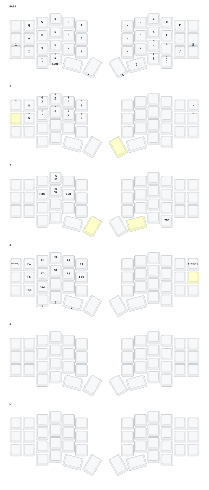

# Noirix44 — DYA Studio + Monitor 固件

这是为 Noirix44 分体键盘、独立 OLED 状态监视器维护的 ZMK 固件仓库。

本项目在原有 Noirix44 键位配置上增加 DYA Studio、运行时配置以及 **Monitor（OLED 状态监视器）** 功能，
参考 [zmk-sofle-dongle-dya](https://github.com/S7venYoung/zmk-sofle-dongle-dya)（monitor 分支）实现。

## 分支说明

| 分支 | 用途 | 状态 |
| --- | --- | --- |
| `dya` | 原 DYA 固件，基于旧版 DYA/ZMK 技术栈 | 稳定 |
| `monitor` | 基于 `main+dya` 和 Zephyr 4.1 的新版适配，新增 OLED 状态监视器 | 当前版本 |

日常使用请选择 `monitor` 分支。

## Monitor 分支功能

- DYA Studio 改键（左半通过 USB 串口）
- Runtime Macro（运行时宏）
- Runtime Combo（运行时组合键）
- Runtime Sensor Rotate（运行时传感器/编码器配置）
- Runtime Input Processor（运行时输入处理器）
- BLE 管理（DYA Studio 查看/管理蓝牙连接）
- Settings RPC（DYA Studio 在线修改并保存设置）
- Device Info（固件、硬件和运行状态诊断）
- 键盘按键统计（累计按键数，NVS 持久化）
- WPM 打字速度统计
- **OLED 状态监视器（Monitor）**：
  - 独立接收器实时监听键盘状态广播
  - 显示左右手电量数字 + 电量横条
  - 显示 USB/BLE 连接状态（U/B）
  - 显示当前层、WPM、修饰键详情（L/W/M）
  - 键盘失联 65 秒后屏幕提示
- DYA Custom Settings 显示设置（13 项，可运行时调整）

### 技术栈

- ZMK：`cormoran/zmk#main+dya`
- Zephyr：`v4.1.0+zmk-fixes+nrf-half-duplex-uart`
- Prospector 状态广播：`prospector-zmk-module` v2.2.2
- DYA Studio Custom Protocol
- `zmk-feature-custom-settings`
- `zmk-feature-device-info`
- `zmk-feature-runtime-macro`
- `zmk-feature-runtime-combo`
- `zmk-behavior-runtime-sensor-rotate`
- `zmk-module-ble-management`
- `zmk-module-battery-history`
- `zmk-module-settings-rpc`
- `zmk-module-runtime-input-processor`

## 固件文件

GitHub Actions 构建完成后，在运行记录的 Artifacts 中下载固件压缩包。

| 固件 | 刷写位置 | 主控 |
| --- | --- | --- |
| `noirix44_left.uf2` | 键盘左半（central） | nRFMicro (nRF52840) |
| `noirix44_right.uf2` | 键盘右半（peripheral） | nRFMicro (nRF52840) |
| `noirix44_monitor_display.uf2` | 独立 OLED 状态监视器 | nice!nano |
| `noirix44_settings_reset.uf2` | 清除键盘配对与设置 | nRFMicro (nRF52840) |
| `noirix44_monitor_settings_reset.uf2` | 清除监视器配对与设置 | nice!nano |

> 键盘左右半、监视器、两个 settings_reset 分别使用不同主控/固件，请按上表对应刷写，不要混刷。

## Monitor 模式

`monitor` 分支为 Noirix44 增加独立的 OLED 状态监视器，采用 Prospector v2.2.2 广播协议，固定频道为 `1`。

工作方式：

| 设备 | 角色 |
|---|---|
| `noirix44_left` | 键盘左半 = central：直连电脑（USB HID）+ 连接右半（BLE）+ **广播状态给监视器** |
| `noirix44_right` | 键盘右半 = peripheral：仅通过 BLE 连接左半 |
| `noirix44_monitor_display` | 独立接收器：无按键，只监听状态广播并显示，不输出键盘 HID |

监视器屏幕实时显示：

- 左右手电量：百分比数字 + 电量横条（尚未收到电量或断开时显示 `--`）
- 连接状态：`U` = USB 直连电脑、`B` = BLE 已连接、`-` = 未连接
- 详情行：`L`（当前层）/ `W`（WPM）/ `M`（修饰键状态码）
- 键盘失联 65 秒后：显示 `WAITING FOR KEYBOARD` 提示

Monitor 接收器是无按键的纯显示设备，不启用 ZMK Studio，因此无法通过 DYA Studio 编辑接收器设置；
键盘侧的 DYA 功能不受影响。

切换拓扑或升级固件前建议先刷对应的 `settings_reset`，然后重新配对右半与左半 central。

升级到 `monitor` 分支时，建议键盘左半、右半和监视器使用同一次 Actions 构建生成的固件，不要混用不同分支或不同构建批次。

如连接异常，可依次刷入 `settings_reset`，再重新刷键盘左右半和监视器固件并重新配对。清除设置会删除已保存的蓝牙配对和运行时配置。

## Runtime Macro

`monitor` 分支已启用 Runtime Macro，现有 keymap 中的静态按键绑定保持不变，两者互不冲突。

keymap 第 3 层（layer_3）第一行最右侧按键已预绑定为：

```dts
&rmacro 0
```

使用方法：

1. 用 USB 连接键盘左半。
2. 打开 DYA Studio。
3. 进入 Macro 页面。
4. 创建 Macro 并确认其 Slot 编号。
5. Slot 0 对应当前预留的 `&rmacro 0` 按键。
6. 点击保存后，Macro 会写入键盘设置。

刚刷入固件、尚未创建 Slot 0 时，按下该键不会执行任何内容。

## Runtime Combo

`monitor` 分支已启用 Runtime Combo，可以通过 DYA Studio 在运行时创建和修改组合键。

它与 Runtime Macro 可以共存：Combo 负责监听多个按键位置，Macro 负责执行一串行为。

使用方法：

1. 用 USB 连接键盘左半并打开 DYA Studio。
2. 进入 Runtime Combo 子系统页面。
3. 选择空 Slot，设置名称、按键位置、输出行为、适用层和超时时间。
4. 保存并测试；需要断电保存时启用持久化选项。

固件只预留运行时 Combo 槽位，没有增加默认 Combo，因此首次刷写不会改变现有按键行为。

## 屏幕显示设置

键盘侧通过 DYA Custom Settings 暴露显示设置。在 DYA Studio 的 Settings 页面可查看/调整；修改后点击 `Write` 即时预览，满意后再点击页面顶部的 `Save` 持久保存。

| 设置 | 作用 | 范围 |
| --- | --- | --- |
| `display_theme` | 显示器主题/布局 | `0`=Classic，`1`=YADS |
| `key_stats_enabled` | 是否显示按键统计 | 开/关 |
| `key_stats_x` | 统计模块横坐标 | 0–78 |
| `key_stats_y` | 统计模块纵坐标 | 0–46 |
| `layer_alignment` | 层级文字对齐方式 | 0–2 |
| `layer_width` | 层级名称滚动区域宽度 | 20–78 |
| `mac_modifiers` | Mac/Windows 修饰符图标 | `true`=Mac，`false`=Windows |
| `dongle_battery_enabled` | 是否显示监视器自身电量 | 开/关 |
| `bongo_cat_enabled` | 是否显示猫动画 | 开/关 |
| `modifiers_enabled` | 是否显示修饰符图标 | 开/关 |
| `layer_enabled` | 是否显示层级名称 | 开/关 |
| `wpm_enabled` | 是否显示 WPM | 开/关 |
| `wpm_disabled_layers` | 不显示 WPM 的层名，逗号分隔 | 字符串 |

`layer_alignment`：

- `0`：左对齐
- `1`：居中
- `2`：右对齐

OLED 熄屏继续使用 ZMK 原生的 Idle 机制，默认无操作约 30 秒后熄屏。

屏幕旋转、分辨率、`segment-offset`、反色和颜色深度仍由设备树固定，不提供运行时修改，以避免 OLED 控制器参数错误导致乱码。

## Device Info

键盘左半固件启用 Device Info。通过 USB 连接左半并打开 DYA Studio 的 Troubleshooting 页面后，可以查看：

- ZMK、Zephyr、配置仓库及模块的版本信息
- 编译时间、板型和固件 Build ID
- MCU、Flash、SRAM 和上次复位原因
- USB、BLE、分体、显示等编译配置
- 运行时间和 Zephyr 设备初始化状态

设备信息默认遵循 Studio 的安全访问设置。

## 按键统计

键盘左半统计物理按键按下次数并 NVS 持久化：

- 仅统计按键按下事件（长按自动重复只计一次物理按下）
- 不统计编码器/鼠标等非按键事件

## Monitor 硬件接线

- 主控：nice!nano
- 屏幕：SH1106 128×64 OLED（I2C 地址 0x3C）
- 接线：OLED SDA → P0.17，SCL → P0.20（I2C0，与 Sofle Monitor 接收器同款）
- 若你的 OLED 接线不同，修改 `boards/shields/monitor_adapter/monitor_adapter.overlay` 中的 `psels`

## 编译

仓库使用 GitHub Actions 自动构建：

1. 切换到 `monitor` 分支。
2. 打开 Actions。
3. 运行 Build workflow，或向该分支提交一次改动。
4. 等待全部 Build Job 完成。
5. 下载 Artifacts。

`monitor` 目前属于开发分支。刷写前必须确认键盘左右半、监视器和两个 `settings_reset` 均构建成功。

## 注意事项

- 不要将 `dya` 和 `monitor` 分支的键盘/监视器固件混刷。
- 修改 DYA 运行时设置前，确保连接的是键盘左半串口。
- 浏览器提示串口已打开时，关闭其他 DYA Studio 页面或占用串口的软件。
- 刷写新版底层后出现连接问题时，优先执行一次完整的 Settings Reset 和重新配对。
- `monitor` 分支仍需通过 Actions 编译和实机验证后再作为日常固件使用。

## 键位图



## 参考项目

- [zmk-sofle-dongle-dya (monitor)](https://github.com/S7venYoung/zmk-sofle-dongle-dya)
- [DYA Studio Developer Guide](https://studio.dya.cormoran.works/developer-guide)
- [cormoran/zmk-feature-runtime-macro](https://github.com/cormoran/zmk-feature-runtime-macro)
- [cormoran/zmk-feature-custom-settings](https://github.com/cormoran/zmk-feature-custom-settings)
- [englmaxi/zmk-dongle-display](https://github.com/englmaxi/zmk-dongle-display)
- [janpfischer/zmk-dongle-screen](https://github.com/janpfischer/zmk-dongle-screen)
