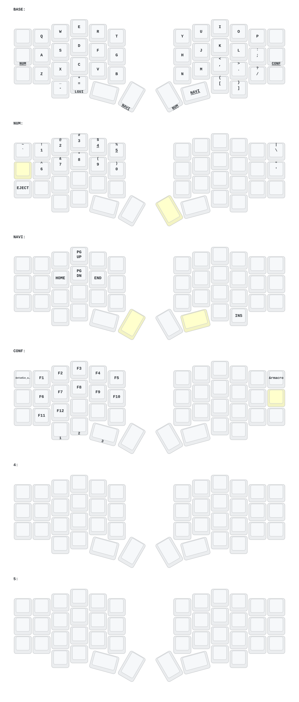

# Noirix44 — DYA Studio + Monitor 固件

这是为 Noirix44 分体键盘、独立 ST7789V 状态监视器维护的 ZMK 固件仓库。

本项目在原有 Noirix44 键位配置上增加 DYA Studio、运行时配置以及 **Monitor（ST7789V 状态监视器）** 功能，
参考 [zmk-sofle-dongle-dya](https://github.com/S7venYoung/zmk-sofle-dongle-dya)（monitor 分支）实现，
屏幕驱动移植自 [carrefinho/prospector-zmk-module](https://github.com/carrefinho/prospector-zmk-module) 的 ST7789V 驱动。

## 分支说明

| 分支 | 用途 | 状态 |
| --- | --- | --- |
| `dya` | 原 DYA 固件，基于旧版 DYA/ZMK 技术栈 | 稳定 |
| `monitor` | 基于 `main+dya` 和 Zephyr 4.1 的新版适配，OLED（SH1106）状态监视器 | 开发中 |
| `st7789v` | 在 `monitor` 基础上换用 **ST7789V 240×280（1.69 英寸）SPI 圆角屏，横放 280×240**（布局重绘、取消触屏） | 当前版本 |

日常使用请选择 `st7789v` 分支。

## Monitor 分支功能

- DYA Studio 改键（左半通过 USB 串口）
- Runtime Macro（运行时宏）
- Runtime Combo（运行时组合键）
- Runtime Sensor Rotate（运行时传感器/编码器配置）
- Runtime Input Processor（运行时输入处理器）
- BLE 管理（DYA Studio 查看/管理蓝牙连接）
- Settings RPC（DYA Studio 在线修改并保存设置）
- Device Info（固件、硬件和运行状态诊断）
- 键盘按键统计（累计按键数，NVS 持久化）
- WPM 打字速度统计
- **ST7789V 状态监视器（Monitor）**：
  - 独立接收器实时监听键盘状态广播
  - **280×240 RGB565 全彩屏幕（1.69 英寸 240×280 圆角屏横放）**，四周圆角留边，固定单一布局（无主题切换）
  - 底部三根电量横条 + 百分比数字，横条按电量从左到右动态填充：左 = 左手电量、中 = **Monitor 自身电量**、右 = 右手电量；百分比前带彩色前缀 **L（蓝）/ M（白）/ R（橙）**
  - 右上角连接状态：USB 状态（`U`/`-`）+ BLE 连接（`B`）+ **当前 BLE Profile 数字**（如 `- B0`）
  - 左上 WPM；中央三行显示：**层名 / 最近输入字符（字母、数字与 US-ANSI 符号）/ mac 风格修饰键图标（⌃⇧⌥⌘，按下时点亮）**
  - 键盘失联 15 秒后屏幕提示（层名位置显示 `WAITING`）
  - 30 秒无状态变化自动息屏（LCD 与背光一起关闭），收到状态变化自动亮屏
- DYA Custom Settings 显示设置（可运行时调整；**主题切换已取消**，屏幕布局固定为单一布局）

> **触屏说明**：本分支固件**不包含触屏功能**，未添加任何触摸控制器节点，屏幕仅作显示使用。

## DYA Studio

本固件的大部分功能（改键、Runtime Macro、Runtime Combo、BLE 管理、Settings、Device Info）都通过 DYA Studio 操作，使用前请先用 USB 连接键盘左半（central），再打开工具：

- **网页版（免安装，推荐）：** https://studio.dya.cormoran.works/
- **桌面客户端下载：** https://github.com/cormoran/dya-studio/releases

浏览器使用网页版时，若提示串口被占用，请关闭其他 DYA Studio 页面或占用串口的软件。

### 技术栈

- ZMK：`cormoran/zmk#main+dya`
- Zephyr：`v4.1.0+zmk-fixes+nrf-half-duplex-uart`
- Prospector 状态广播：`prospector-zmk-module` v2.2.2
- DYA Studio Custom Protocol
- `zmk-feature-custom-settings`
- `zmk-feature-device-info`
- `zmk-feature-runtime-macro`
- `zmk-feature-runtime-combo`
- `zmk-behavior-runtime-sensor-rotate`
- `zmk-module-ble-management`
- `zmk-module-battery-history`
- `zmk-module-settings-rpc`
- `zmk-module-runtime-input-processor`
- ST7789V 屏幕驱动：`carrefinho/prospector-zmk-module`（SPI 直驱，自定义 `noirix,st7789v` binding）

## 固件文件

GitHub Actions 构建完成后，在运行记录的 Artifacts 中下载固件压缩包。

| 固件 | 刷写位置 | 主控 |
| --- | --- | --- |
| `noirix44_left.uf2` | 键盘左半（central） | nRFMicro (nRF52840) |
| `noirix44_right.uf2` | 键盘右半（peripheral） | nRFMicro (nRF52840) |
| `noirix44_monitor_display.uf2` | 独立 ST7789V 状态监视器 | nice!nano |
| `noirix44_settings_reset.uf2` | 清除键盘配对与设置 | nRFMicro (nRF52840) |
| `noirix44_monitor_settings_reset.uf2` | 清除监视器配对与设置 | nice!nano |

> 键盘左右半、监视器、两个 settings_reset 分别使用不同主控/固件，请按上表对应刷写，不要混刷。

## Monitor 模式

`st7789v` 分支为 Noirix44 增加独立的 ST7789V 状态监视器，采用 Prospector v2.2.2 广播协议，固定频道为 `1`。

工作方式：

| 设备 | 角色 |
|---|---|
| `noirix44_left` | 键盘左半 = central：直连电脑（USB HID）+ 连接右半（BLE）+ **广播状态给监视器** |
| `noirix44_right` | 键盘右半 = peripheral：仅通过 BLE 连接左半 |
| `noirix44_monitor_display` | 独立接收器：无按键，只监听状态广播并显示，不输出键盘 HID |

监视器屏幕实时显示（固定单布局，280×240，无主题切换）：

```
WPM 42          U B2
      BASE
       H!@
    ⌃ ⇧ ⌥ ⌘
  L 85%   M 62%   R 18%
 [=====] [=====]  [===]
```

- 左上：WPM 打字速度（未收到广播时显示 `WPM --`）
- 右上：连接状态 + 当前 BLE Profile。格式为 `U B0` / `- B0` / `U -` / `- -`：
  - 第 1 位 `U` = 键盘通过 USB 直连电脑，`-` = 未插 USB
  - `B` 后跟数字 = BLE 已连接时的 Profile 编号（来自键盘广播）
  - BLE 未连接时不显示 B 与数字
- 中央三行（大字号）：
  - 第 1 行：当前层名（来自键盘广播的 layer_name）；无层名时回退显示 `LAYER <n>`
  - 第 2 行：最近输入的字符（最多 5 个，实时更新；支持字母、数字、空格与 US-ANSI 符号，如 `H!@`；Shift 产生符号、退格删除字符、Ctrl/Alt/Cmd 组合键不显示）
  - 第 3 行：mac 风格修饰键图标 `⌃ ⇧ ⌥ ⌘`（按下时点亮）
- 底部三根横条 + 百分比数字（前缀 L 蓝 / M 白 / R 橙，横条按电量从左到右填充）：
  - 左条 = 左手电量，右条 = 右手电量，**中条 = Monitor 自身电量**（每 60 秒采样一次）
  - 横条分色：>30% 绿、10–30% 黄、≤10% 红
  - 收到广播前或电量不可用显示 `--%`
- 键盘失联（开机后未收到广播，或超过 15 秒没有新广播）：
  - 中央层名位置显示 `WAITING`
  - WPM 显示 `WPM --`、连接状态显示 `-- --`、左右手电量显示 `--%`
  - 中条（Monitor 自身电量）继续实时显示
- **息屏策略**：30 秒无状态变化自动息屏（LCD 关闭 + 背光关闭）；收到键盘状态变化自动亮屏，从变化后的内容开始显示（息屏期间的内容不保留）

Monitor 接收器是无按键的纯显示设备，不启用 ZMK Studio，因此无法通过 DYA Studio 编辑接收器设置；
键盘侧的 DYA 功能不受影响。

切换拓扑或升级固件前建议先刷对应的 `settings_reset`，然后重新配对右半与左半 central。

升级到 `st7789v` 分支时，建议键盘左半、右半和监视器使用同一次 Actions 构建生成的固件，不要混用不同分支或不同构建批次。

如连接异常，可依次刷入 `settings_reset`，再重新刷键盘左右半和监视器固件并重新配对。清除设置会删除已保存的蓝牙配对和运行时配置。

## Runtime Macro

`st7789v` 分支已启用 Runtime Macro，现有 keymap 中的静态按键绑定保持不变，两者互不冲突。

keymap 第 3 层（layer_3）第一行最右侧按键已预绑定为：

```dts
&rmacro 0
```

使用方法：

1. 用 USB 连接键盘左半。
2. 打开 DYA Studio。
3. 进入 Macro 页面。
4. 创建 Macro 并确认其 Slot 编号。
5. Slot 0 对应当前预留的 `&rmacro 0` 按键。
6. 点击保存后，Macro 会写入键盘设置。

刚刷入固件、尚未创建 Slot 0 时，按下该键不会执行任何内容。

## Runtime Combo

`st7789v` 分支已启用 Runtime Combo，可以通过 DYA Studio 在运行时创建和修改组合键。

它与 Runtime Macro 可以共存：Combo 负责监听多个按键位置，Macro 负责执行一串行为。

使用方法：

1. 用 USB 连接键盘左半并打开 DYA Studio。
2. 进入 Runtime Combo 子系统页面。
3. 选择空 Slot，设置名称、按键位置、输出行为、适用层和超时时间。
4. 保存并测试；需要断电保存时启用持久化选项。

固件只预留运行时 Combo 槽位，没有增加默认 Combo，因此首次刷写不会改变现有按键行为。

## Device Info

键盘左半固件启用 Device Info。通过 USB 连接左半并打开 DYA Studio 的 Troubleshooting 页面后，可以查看：

- ZMK、Zephyr、配置仓库及模块的版本信息
- 编译时间、板型和固件 Build ID
- MCU、Flash、SRAM 和上次复位原因
- USB、BLE、分体、显示等编译配置
- 运行时间和 Zephyr 设备初始化状态

设备信息默认遵循 Studio 的安全访问设置。

## 按键统计

键盘左半统计物理按键按下次数并 NVS 持久化：

- 仅统计按键按下事件（长按自动重复只计一次物理按下）
- 不统计编码器/鼠标等非按键事件

## Monitor 硬件接线

- 主控：nice!nano **v2**（`build.yaml` 中 `nice_nano//zmk` 在 Zephyr 4.1 新命名下即指 v2；P1.00/P0.24 是 v2 引脚，与接线一致，build.yaml 无需修改）
- 屏幕：ST7789V 240×280（1.69 英寸）SPI 圆角屏，**横放显示，LVGL 分辨率 280×240**（RGB565，无触摸；`monitor_adapter.overlay` 中 `width=280 / height=240 / x-offset=20 / mdac=0x60`）
- 接线：

| 屏幕信号 | 引脚 |
| --- | --- |
| SCK | P0.17 |
| MOSI | P0.20 |
| CS | P1.00 |
| DC | P0.24 |
| RST | P0.22 |
| BL（背光，PWM1） | P0.11 |

- 若你的接线不同，修改 `boards/shields/monitor_adapter/monitor_adapter.overlay` 中的 `psels` / `cs-gpios` / `cmd-data-gpios` / `reset-gpios` / `pwms`
- 若屏幕颜色红蓝对调，将 `boards/shields/dongle_display/Kconfig.defconfig` 中 `LV_COLOR_16_SWAP` 改为 `y`

## 编译

仓库使用 GitHub Actions 自动构建：

1. 切换到 `st7789v` 分支。
2. 打开 Actions。
3. 运行 Build workflow，或向该分支提交一次改动。
4. 等待全部 Build Job 完成。
5. 下载 Artifacts。

`st7789v` 目前属于开发分支。刷写前必须确认键盘左右半、监视器和两个 `settings_reset` 均构建成功。

## 已知问题与使用建议

### 右手（peripheral）单独断电重开无法自动重连

**现象**：只关闭右手键盘的电源再重新打开，右手有时无法自动与左手（central）重连；把左手也关闭再打开（或左右手同时重启）后即可恢复连接。

**原因**：这是 ZMK 分体 BLE 的已知时序问题。右手断电属于"非优雅断开"，左手需要等待 supervision timeout（默认约 4 秒）才感知断开并重新扫描；而右手重新上电后先进入短暂的直连广播窗口，随后转为低速广播（约 1.28 秒一次、窗口极小）。当左手的重扫窗口与右手的低速广播错开时，就会持续错过，直到左手重启、BLE 栈整体复位后才重新对齐。

**使用建议**：

- 日常使用中，右手中途断电重开时，先等待 **5~10 秒**，一般可自动连回；
- 若超过 10 秒仍未连回，将左右手同时关闭再打开即可恢复；
- 这是 ZMK 生态的普遍现象，不是硬件故障，不影响正常使用；
- 当前版本**不做代码层面修复**，保持 ZMK 原生重连行为。

## 注意事项

- 不要将 `dya` / `monitor` / `st7789v` 分支的键盘/监视器固件混刷。
- 修改 DYA 运行时设置前，确保连接的是键盘左半串口。
- 浏览器提示串口已打开时，关闭其他 DYA Studio 页面或占用串口的软件。
- 刷写新版底层后出现连接问题时，优先执行一次完整的 Settings Reset 和重新配对。
- `st7789v` 分支仍需通过 Actions 编译和实机验证后再作为日常固件使用。

## 键位图



## 参考项目

- [zmk-sofle-dongle-dya (monitor)](https://github.com/S7venYoung/zmk-sofle-dongle-dya)
- [carrefinho/prospector-zmk-module（ST7789V 驱动来源）](https://github.com/carrefinho/prospector-zmk-module)
- [DYA Studio Developer Guide](https://studio.dya.cormoran.works/developer-guide)
- [cormoran/zmk-feature-runtime-macro](https://github.com/cormoran/zmk-feature-runtime-macro)
- [cormoran/zmk-feature-custom-settings](https://github.com/cormoran/zmk-feature-custom-settings)
- [englmaxi/zmk-dongle-display](https://github.com/englmaxi/zmk-dongle-display)
- [janpfischer/zmk-dongle-screen](https://github.com/janpfischer/zmk-dongle-screen)
